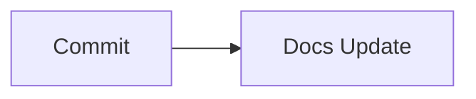

## Block Templates (Reference)

:::changelog{title="Template reference"}
::changelog-item{type="improved" description="Prepared simple templates for block-based updates used in later commits."}
:::

### Example: Changelog block

:::changelog{title="Release"}
::changelog-item{type="added" description="Example item"}
:::

### Example: TeX and Mermaid

```tex
\sum_{n=1}^{3} n = 6
```


